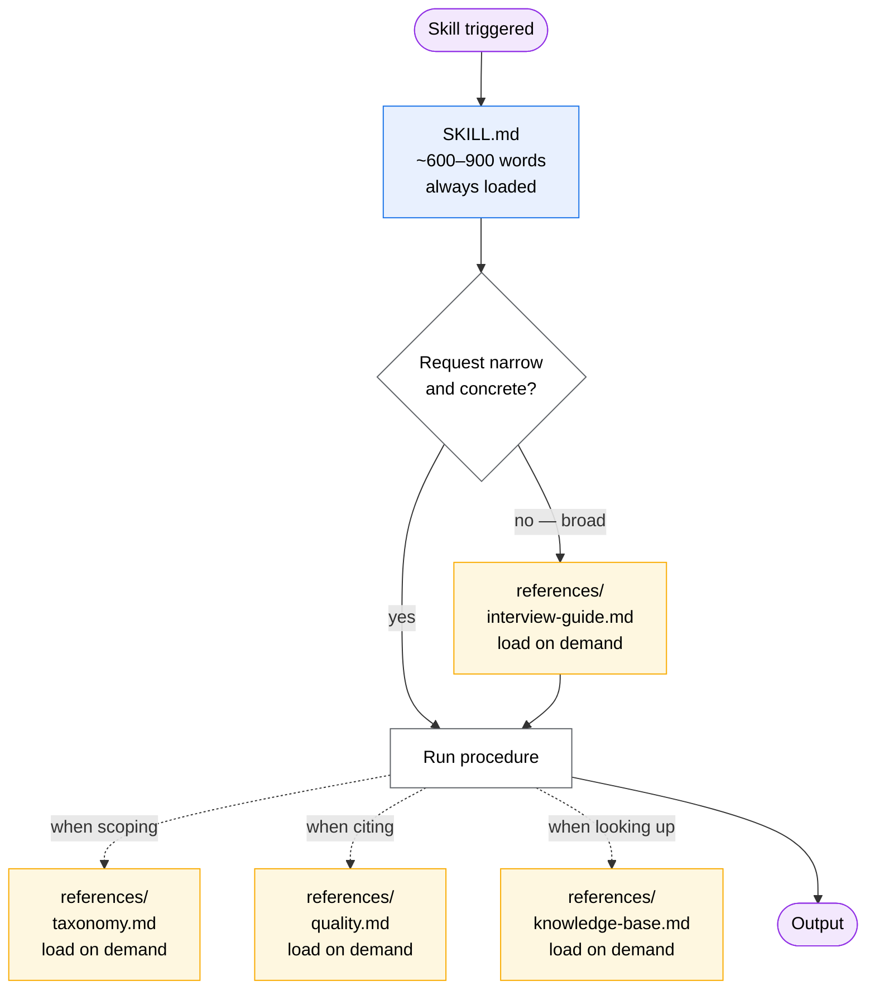
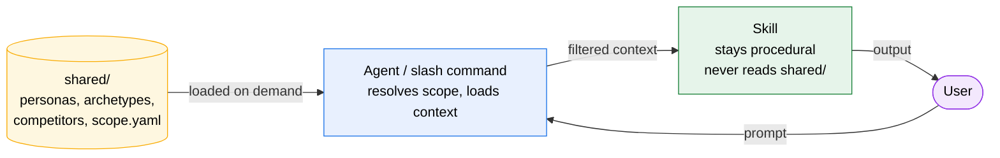
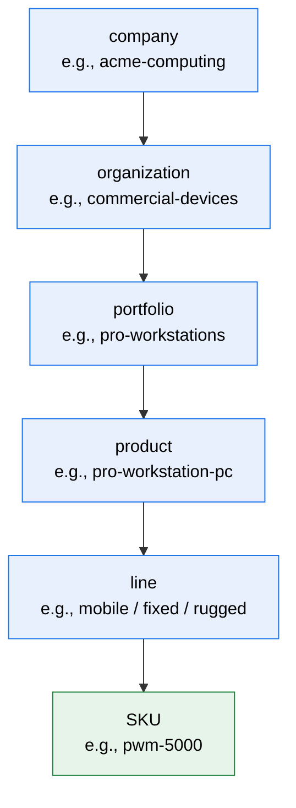
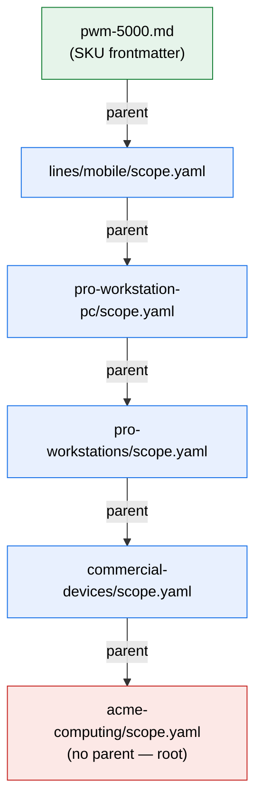
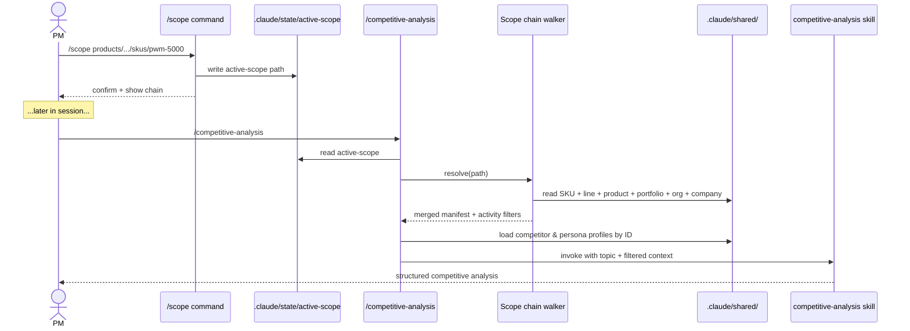

# Architecture & design pattern

The blueprint for skills, agents, and the meta-tooling that scaffolds them. Every skill and agent in the catalogue should conform to this pattern. New skills are produced by the scaffolder (`/new-skill`), which uses this blueprint to interview the author and emit a conformant entry.

This document is the **source of truth** for the pattern. The two example skills (`market-intelligence`, `competitive-analysis`) and the example orchestrator (`research-analyst`) are research-flavored *instances* — they demonstrate the pattern in one domain. Other domains (code review, deployment, design, audit, etc.) apply the same pattern with shape-appropriate content.

## Concepts

### Primitives — what gets shipped

| Primitive | Role |
| --- | --- |
| **Skill** | Procedure that runs when triggered. Tool-agnostic markdown. Self-contained. |
| **Agent** | Orchestrator that loads context, delegates to skills, synthesizes output. |
| **Shared** | Read-only context (personas, strategy, archetypes, branding, templates). Loaded by agents only — never by skills. |

### Metas — what produces the primitives

| Meta | Role |
| --- | --- |
| **Blueprint** | This document. Defines the required and optional shape of skills and agents. |
| **Scaffolder** | Interview-driven slash commands (`/new-skill`, `/new-agent`) that produce blueprint-conformant entries. |

## Skill anatomy

### Required (every skill, always loaded)

- `SKILL.md` frontmatter:
  - `name` — kebab-case, matches directory name
  - `description` — single sentence with rich triggers (multiple phrasings the model might match against)
- `SKILL.md` body:
  - When-this-triggers list (bulleted, concrete)
  - Procedure (numbered steps)
  - Output format (sections in order)
  - Constraints

`SKILL.md` should stay compact. Target 600–900 words. Anything heavier moves to `references/`.

### Optional (loaded on demand)

| Module | Purpose |
| --- | --- |
| `references/interview-guide.md` | Briefing protocol for ambiguous or decision-bearing requests |
| `references/taxonomy.md` | Categorical menus — question dimensions, error categories, evaluation criteria. Doubles as output-section menu when applicable. |
| `references/quality.md` | Domain-specific quality conventions — citation format, severity rubrics, reliability frameworks |
| `references/knowledge-base.md` | Reference content the procedure points at — API surface, framework primer, glossary |
| `templates/*.md` | Golden-source structures the skill writes from (read-only — skill creates new files based on them) |
| `examples/*.md` | Sample inputs and expected outputs |

### Progressive disclosure

`SKILL.md` is always loaded. References load only when their content is needed. The skill body links to the references at the moments they apply (e.g., "if the request is ambiguous, read `references/interview-guide.md` and run that protocol").

This keeps the always-loaded surface small and lets a skill carry deep knowledge without paying the token cost on every invocation.



## Skill shapes

Every skill picks one of two shapes. The shape determines whether a briefing protocol exists and what reference modules are typical.

| Shape | When | Typical references |
| --- | --- | --- |
| **Procedural** | Mechanical task. Run-on-invoke. Format conversion, validation, lint, lookup, code generation. | `knowledge-base` (if applicable). No interview needed. |
| **Interview-driven** | Decision-supporting work where scope can be ambiguous. Research, audit, design review, retrospective. | `interview-guide` + `taxonomy` + `quality`. |

Reference modules are an orthogonal axis. Either shape can include any subset of references that earn their weight.

### Two-path branching (interview-driven shape only)

Interview-driven skills offer two paths in the SKILL.md body:

1. **Direct path** — narrow, concrete request. Skip the briefing. Jump to procedure.
2. **Briefing path** — broad or decision-bearing request. Load `references/interview-guide.md` and run the protocol before the procedure.

The skill (or its caller) picks the path based on prompt clarity. *Smart by default; only ask when ambiguous.*

### Type classification (when applicable)

Some interview-driven skills cover several adjacent shapes within one domain (e.g., `market-intelligence` covers market, technology, and strategic research). Such skills include a **classification step** in the body that identifies the dominant type and drives source priorities + output-section selection. Type maps to taxonomy categories in `references/taxonomy.md`.

Skills that don't span shapes don't need a classification step.

### Conditional output sections

The output structure adapts to the brief. Skills declare a **section menu** (typically by referencing the taxonomy headings) and include only the sections that materially answer the question. The menu is a guide, not a checklist.

### Gap-analysis pass

Before delivery, the skill runs an internal pass: *what would a decision-maker reading this still want to know?* Generate 3–7 missing-angle questions, run targeted lookups, fold the answers into the output. Quality control, not a user-visible step.

## Agent anatomy

### Required

- frontmatter:
  - `name` — kebab-case, matches filename stem
  - `description` — single sentence describing when to delegate
  - `tools` *(optional)* — comma-separated restriction list; omit to inherit all
  - `model` *(optional)* — `opus` | `sonnet` | `haiku` | `inherit`
- body:
  - Role (one paragraph)
  - When to use (triggers)
  - Delegation map (which skills the agent invokes for which kinds of requests)
  - Output structure
  - Constraints

Agents are thin orchestrators. They don't reimplement skill procedures.

### Optional

- **Q&A scope-clarification block** — for orchestrators that need to disambiguate broad requests before delegating. *Smart by default; only ask when ambiguous.*
- **Shared context loading rules** — for orchestrators that pull from `shared/` based on what the user is asking about. Document the triggers explicitly.

## Shared context flow



One-directional. Skills do **not** read `shared/` directly. Agents own context injection.

This keeps skills tool-agnostic and reusable across companies, organizations, and contexts. Shared content (personas, archetypes, strategy, branding, portfolios) is loaded by the agent into the conversation before the skill is invoked, so the skill sees the context as part of its working memory without being coupled to the directory layout.

### Why agents own injection (not `CLAUDE.md`)

Tool-agnosticism. `CLAUDE.md` is a Claude Code mechanism. Skills and agents in this catalogue must work in Claude Code, Cursor, Windsurf, Cascade, or any harness that consumes markdown agent definitions. Putting injection logic in agent and skill bodies (which are pure markdown) keeps the catalogue portable.

## Composition rules

- Agents invoke skills.
- Skills can mention other skills by name in text — informational, not a formal dependency.
- An agent can be **thin** (delegates to one skill, light orchestration) or **fan-out** (orchestrates multiple skills, synthesizes their outputs).
- Skills produce output for whoever called them — the agent if delegated, the user if invoked directly.
- Shared context flows in one direction only (above).

## Scaffolder behavior

The scaffolder is the practical embodiment of the blueprint. It interviews the author and emits a conformant entry.

### `/new-skill`

Asks:

1. Name + description (rich triggers).
2. **Shape** — procedural or interview-driven.
3. **Reference modules** — which apply: `interview-guide`, `taxonomy`, `quality`, `knowledge-base`.
4. **Templates / examples** — does the skill ship golden-source templates or sample I/O?
5. Output format expectations.
6. Constraints.

Produces:

- `.claude/skills/<name>/SKILL.md` with frontmatter + body skeleton matching the chosen shape.
- `.claude/skills/<name>/references/*.md` stubs for each chosen module.
- `.claude/skills/<name>/templates/` and `examples/` directories if requested.

### `/new-agent`

Asks:

1. Name + description.
2. Tool restrictions (or inherit all).
3. **Loads `shared/` context?** — if yes, on what triggers and from which subdirectories.
4. **Delegates to which skills** — the delegation map.
5. **Has a Q&A scope-clarification step?** — if yes, what triggers the Q&A and what it asks.

Produces:

- `.claude/agents/<name>.md` with frontmatter + body skeleton.

### Validation

After scaffolding, the entry is validated by `scripts/validate.py` (frontmatter and naming conformance) and indexed by `scripts/index-readme.py` (catalogue tables in `README.md`). Pre-commit hook (`scripts/install-hooks.sh`) runs both.

## Working examples

| Example | Shape | Demonstrates |
| --- | --- | --- |
| `.claude/agents/research-analyst.md` | Fan-out orchestrator | Q&A scope-clarification + opt-in `shared/` injection + delegation to multiple skills |
| `.claude/skills/market-intelligence/` | Interview-driven, multi-type | Two-path branching, type classification, full reference set (`interview-guide`, `taxonomy` doubling as output menu, `quality`) |
| `.claude/skills/competitive-analysis/` | Interview-driven, single-type | Two-path branching, taxonomy as output menu |

These are research-domain instances. The same blueprint applies to domains the catalogue hasn't yet covered (code review, deployment, design, audit, support, sales enablement, …) — each instance picks its shape and reference modules and fills in domain content.

## Shared context hierarchy

`shared/` is a structured catalog of organizational context that agents inject into skills. It is **not** an unstructured pile of documents — it follows a six-level hierarchy with an explicit scoping mechanism.

### Hierarchy



```
company → organization → portfolio → product → line → SKU
```

Each level is a unit of context. Higher levels carry broader, longer-lived material (company identity, charter). Lower levels carry narrower, faster-changing material (SKU specs, head-to-head competitor pairs). Lower levels inherit from higher levels.

### Four files per hierarchy unit (above SKU)

Cutting-edge enterprise structure: structured-first, narrative as optional supplement.

| File | Cadence | Purpose |
| --- | --- | --- |
| `identity.yaml` | annual | Mission, vision, position, brand pillars, what-we-are-not. Slowest-changing. |
| `charter.yaml` | rare (re-org) | Mandate, in/out scope, decision rights, stakeholders, success metrics, ownership. |
| `strategy.yaml` | quarterly | Horizon, priorities, initiatives, hypotheses, time horizons, risks, key competitors. |
| `scope.yaml` | as personas/competitors shift | Operational manifest — personas, archetypes, competitors, related units, per-activity filters. |
| `narrative.md` *(optional)* | as needed | Free prose for the "why" — brand voice, rationale, color. Only when structured fields can't carry the meaning. |

Different update cadences, different owners, different schemas, different review cycles. Schema-first, narrative-as-supplement is the enterprise pattern.

### SKUs are single files (frontmatter-heavy)

SKUs are leaf nodes — concrete shippable models. They are mostly structured data (specs, price, head-to-head competitor SKU pairs) plus a short positioning paragraph. One `.md` file per SKU with YAML frontmatter.

### Atomic, reusable profiles

Personas, archetypes, and competitors live outside the hierarchy and are referenced by ID from `scope.yaml`. They are reusable atomic units, not duplicated per product.

| Type | Lives at | Format | Referenced by |
| --- | --- | --- | --- |
| Persona | `shared/personas/<id>.yaml` | YAML | `scope.yaml` files and SKU frontmatter |
| Archetype | `shared/archetypes/<id>.yaml` | YAML | `scope.yaml` files and SKU frontmatter |
| Competitor | `shared/competitors/<id>.md` | Markdown + frontmatter | `scope.yaml` files and SKU `competitor_skus` mappings |

Personas live flat (no `internal/` vs `external/` subdirectories) — the `type:` field in the YAML carries that distinction.

### Full layout

```
shared/
├── company/<name>/
│   ├── identity.yaml
│   ├── charter.yaml
│   ├── strategy.yaml
│   └── scope.yaml
├── organizations/<name>/
│   ├── identity.yaml
│   ├── charter.yaml
│   ├── strategy.yaml
│   └── scope.yaml
├── portfolios/<name>/
│   ├── identity.yaml
│   ├── charter.yaml
│   ├── strategy.yaml
│   └── scope.yaml
├── products/<name>/
│   ├── identity.yaml
│   ├── charter.yaml
│   ├── strategy.yaml
│   ├── scope.yaml
│   └── lines/
│       └── <line>/
│           ├── scope.yaml
│           └── skus/
│               ├── <sku-id>.md
│               └── <sku-id>.md
├── personas/<id>.yaml
├── archetypes/<id>.yaml
└── competitors/<id>.md
```

## Schemas — identity / charter / strategy / scope

### identity.yaml

```yaml
display_name: <Display Name>
type: company | organization | portfolio | product | line
mission: |
  Multi-line mission statement.
vision: |
  Multi-line vision statement.
values:                          # company level only
  - name: <value name>
    description: <one line>
brand_promise: |                 # company level only
  Multi-line.
position:
  - Statement 1
  - Statement 2
brand_pillars:                   # portfolio / product / line
  - name: <pillar name>
    description: <one line>
not:                             # what we are not
  - Item 1
  - Item 2
form_factors:                    # portfolio / product where applicable
  - name: <form factor>
    description: <one line>
sku_lineup:                      # product level only
  - id: <sku-id>
    name: <full name>
    line: <line>
    positioning: <one line>
placeholders:                    # TBD validation notes
  - "Confirm against ..."
last_reviewed: YYYY-MM-DD
```

### charter.yaml

```yaml
mandate: |
  What this unit is responsible for.
scope:
  in_scope:  [...]
  out_of_scope: [...]
decision_rights:
  - decision: <area>
    owner: <role>
key_stakeholders:                # structure varies by level
  customers: [...]
  partners: [...]
  channel: [...]
  internal: [...]
  regulators: [...]
operating_cadence:
  - Monthly portfolio review
  - Quarterly QBR
success_metrics:
  - <metric>
ownership:
  owner: <role-id>
  contributors: [...]
  review_cadence: annual | quarterly
placeholders: [...]
last_reviewed: YYYY-MM-DD
```

### strategy.yaml

```yaml
horizon: 2026-2028
strategic_vision: |
  Multi-line.
where_we_play:
  geographies: [...]
  customer_segments: [...]       # may be plain list or structured with id/name/description
  form_factors: [...]
  categories: [...]              # company level
how_we_win:
  - title: <pillar>
    description: |
      Multi-line.
priorities:
  - id: <priority-id>
    title: <title>
    rationale: <one line or multi-line>
    status: active | committed | planned | retired
    success_signals: [...]
initiatives:                     # optional — concrete in-flight work
  - id: <init-id>
    title: <title>
    priority: <priority-id>
    status: planned | in_progress | landed | abandoned
    target: 2026-Q4
hypotheses:                      # optional — assumptions worth testing
  - statement: <one line>
    confidence: high | medium | low
    test: <how to validate>
success_metrics: [...]
time_horizons:
  now: <0–6 mo>
  next: <6–18 mo>
  future: <18 mo+>
key_competitors:                 # portfolio / product
  - id: <competitor-id>
    note: <relationship>
key_risks: [...]
review_cadence: quarterly | annual
placeholders: [...]
last_reviewed: YYYY-MM-DD
```

### scope.yaml

Every hierarchy level (above SKU) has a `scope.yaml`. Inheritance is implicit: a child inherits the parent's lists; the child can add to them or use `excluded:` to remove inherited items.

```yaml
parent: products/pro-workstation-pc            # path under shared/, walks up the chain
related: [portfolios/acme-plus]                # peers worth knowing about

personas:
  primary:   [cad-design-engineer, engineering-manager]
  secondary: [creative-director]
  excluded:  [it-procurement-lead]             # remove if inherited

archetypes:
  primary:   [performance-maximizer, innovator]
  excluded:  [cost-conscious]

competitors:
  primary:   [hp-z, lenovo-thinkstation, apple]
  secondary: [boxx, puget-systems]
  excluded:  [framework]

# Per-activity filters. Each activity slash command pulls its own block.
activity_scope:
  market-research:
    include_segments: [pro-cad, pro-creative, pro-engineering]
    exclude_segments: [consumer, gaming, enterprise-server]
    horizon: 3-year
  competitive-analysis:
    primary_set:        [hp-z, lenovo-thinkstation]
    dimensions:         [performance, iso-cert, configurability, support-sla]
    exclude_dimensions: [gaming-features, consumer-design]
  prd-definition:
    target_personas:  [cad-design-engineer, engineering-manager]
    target_archetypes: [performance-maximizer, innovator]
```

## SKU file format

A SKU is a single markdown file with structured frontmatter and a short positioning narrative. Frontmatter carries all the data that activity commands need; the narrative is for the agent's prose understanding.

```yaml
---
id: pwm-5000
display_name: Pro Workstation Mobile 5000
line: mobile
status: current                  # current | legacy | upcoming | discontinued
launch_year: 2025
positioning: Thin-and-light pro mobile

specs:
  cpu_options:    [intel-core-ultra-7, intel-core-ultra-9]
  gpu_options:    [nvidia-rtx-4070-ada, nvidia-rtx-5000-ada]
  ram_max_gb:     96
  display:        16-inch OLED 4K
  weight_kg:      1.85
  battery_hours:  12

price_range_usd: [2400, 4800]
target_use_cases: [cad-on-the-go, creative-mobile, field-engineering]

# Optional persona overrides. Inherits from line if absent.
personas:
  primary:   [cad-design-engineer, creative-director]
  secondary: [engineering-manager]

archetypes:
  primary: [performance-maximizer, innovator]

# 1:1 head-to-head competitor SKU pairs
competitor_skus:
  primary:
    - id: hp-zbook-studio-g11
      our_advantage:   [iso-cert-breadth, gpu-options]
      their_advantage: [weight, battery-life]
    - id: macbook-pro-16-m4-max
      our_advantage:   [configurability, isv-cert]
      their_advantage: [battery-life, perf-per-watt]
---

# Pro Workstation Mobile 5000

[1–2 paragraphs of positioning narrative.]
```

## Competitor file format

Competitor files describe a competitor brand or line and roster their SKUs as reference data. SKU mappings on our side reference these IDs.

```yaml
---
id: hp-z
parent_company: hp-inc
category: workstations
positioning: ISV-certified workstations, ZBook (mobile) + Z (desktop)

lineup:
  - id: hp-zbook-studio-g11
    line: mobile
    positioning: thin-and-light pro mobile
  - id: hp-zbook-power-g11
    line: mobile
    positioning: desktop-replacement mobile
  - id: hp-z2-mini-g9
    line: compact
  - id: hp-z4-g5
    line: tower
---

# HP Z

[Narrative — strengths, weaknesses, strategic direction.]
```

## Scope resolution

When an activity command runs, it walks the hierarchy from the active scope up to the company root, merging each level's `scope.yaml` (or the SKU's frontmatter, for SKU-level scopes).



Merge rules:
- Lists concatenate.
- A child's `excluded:` removes items inherited from parents.
- A child's `primary:` overrides a parent's `secondary:` for the same item (promotion).
- Activity filters (`activity_scope.<name>`) work the same way per key.

## `/scope` and activity slash commands

### End-to-end flow



### State file

`/scope` writes a single line — the active scope path under `shared/` — to:

```
.claude/state/active-scope
```

The directory is gitignored. State persists across the session, lives outside git so multiple PMs working in the same repo can have different active scopes locally.

### `/scope` command

| Invocation | Effect |
| --- | --- |
| `/scope products/pro-workstation-pc/lines/mobile/skus/pwm-5000` | Validates path exists, writes to state file. |
| `/scope products/pro-workstation-pc/lines/mobile` | Same, line-level scope. |
| `/scope` (no args) | Prints current scope and the resolved chain. |
| `/scope clear` | Empties the state file. |

### Activity slash commands (e.g., `/competitive-analysis`)

Each activity command:

1. Resolves scope. Use `--scope <path>` flag if passed; else read state file; else prompt for `/scope`.
2. Walks the chain from active scope up to company root, reading each `scope.yaml` (or SKU frontmatter for SKU paths).
3. Merges the manifests per the rules above.
4. Extracts `activity_scope.<command-name>` filters.
5. Loads referenced atomic profiles (`shared/personas/<id>.yaml`, `shared/archetypes/<id>.yaml`, `shared/competitors/<id>.md`, etc.).
6. Invokes the underlying skill or agent with the resolved, filtered context.

The skill itself stays generic — it never reads `shared/`, `scope.yaml`, or the state file. Scope resolution is the slash command's job.

### Per-invocation override

For one-off cross-scope work, no `/scope` switch needed:

```
/competitive-analysis --scope products/pro-workstation-pc/lines/rugged "vs Toughbook"
```

The flag wins over the state file for that invocation only.

### Missing-scope behavior

If `.claude/state/active-scope` is empty and no `--scope` flag is provided, the activity command pauses and prompts:

> No active scope set. Run `/scope <path>` first, or pass `--scope <path>` to this invocation.

Better than running unscoped — keeps PMs from accidentally running a wide search when they meant a narrow one.

### One repo, many PMs

Each PM sets their own scope. The state file is per-clone, gitignored. Three PMs working from one repo can hold three different active scopes simultaneously without conflict.

| PM | Scope | What `/competitive-analysis` produces |
| --- | --- | --- |
| Mobile workstation PM | `products/pro-workstation-pc/lines/mobile/skus/pwm-5000` | 1:1 head-to-head: 5000 vs ZBook Studio + MacBook Pro 16 + ThinkPad P1 |
| Rugged PM | `products/pro-workstation-pc/lines/rugged` | Rugged line vs Panasonic Toughbook + Dell Latitude Rugged + Getac |
| Portfolio PM | `portfolios/pro-workstations` | Pro Workstations vs HP Z (full) + Lenovo ThinkStation (full) + BOXX |

## Status — what exists vs. what's new

| Element | Status |
| --- | --- |
| Skill frontmatter + body | ✅ Codified in CONTRIBUTING.md |
| Progressive disclosure pattern | ⚠️ Demonstrated in two skills, not yet codified beyond this document |
| Two skill shapes | ❌ This document is the first articulation |
| Reference modules (`interview-guide`, `taxonomy`, `quality`, `knowledge-base`) | ❌ Conventions named here for the first time |
| Agent frontmatter + body | ✅ Codified in CONTRIBUTING.md |
| Shared context flow | ⚠️ Demonstrated in `research-analyst`; documented here |
| `/new-skill` interview | ⚠️ Exists but does not ask about shape or reference modules |
| `/new-agent` interview | ⚠️ Exists but does not ask about `shared/` injection or delegation map |
| `_template/SKILL.md` | ⚠️ Trivial; doesn't demonstrate the rigorous pattern |
| `_template.md` (agent) | ⚠️ Trivial; doesn't demonstrate orchestration patterns |

## Implementation order (recommended)

1. Adopt this document as the source of truth.
2. Rewrite `_template/SKILL.md` and `_template.md` (agent) to demonstrate the rigorous pattern with placeholders and "skip if not needed" markers.
3. Upgrade `/new-skill` to ask about shape + reference modules and scaffold accordingly.
4. Upgrade `/new-agent` to ask about `shared/` injection rules and delegation map.
5. Apply the pattern to additional domains as new skills are commissioned.
